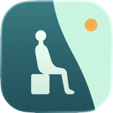
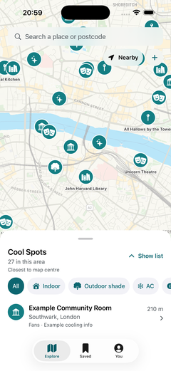
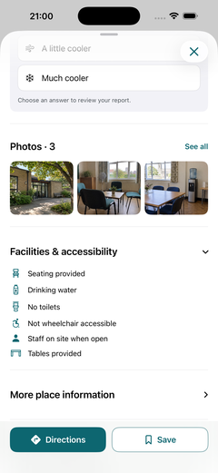
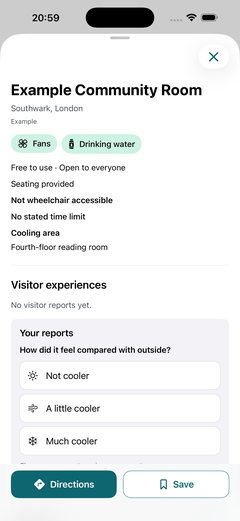
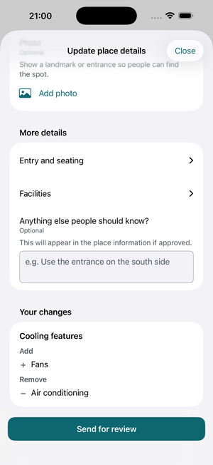
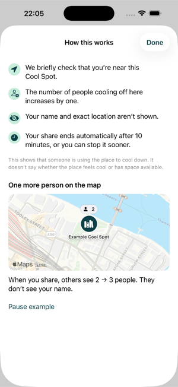

# Cool Spot

**Find a place to cool down in London.**

Cool Spot is a native iOS prototype for finding places to cool down in London. It integrates the Greater London Authority's (GLA) [2025 Cool Spaces data](https://data.london.gov.uk/dataset/cool-space-data-2025-2z19p) with Apple Maps search, so people can check cooling and access information before they go.

| Explore | Place detail · Illustrative photos | Report · Choose how it felt |
| :---: | :---: | :---: |
|  |  |  |

## Features

- **Find a cooling place.** Browse the map or place list; filter for indoor spaces, outdoor shade, air conditioning, free entry or water. Search places with Apple Maps.
- **See where people are cooling off.** View recent anonymous shares on the map and use **I’m cooling off here** to share for 10 minutes. Presence and proximity are simulated in this prototype.
- **Check the details.** See cooling features, cost, access restrictions and available photos, then open directions.
- **Save places for later.** Keep places and private notes in **Saved**.
- **Report a visit.** For an eligible visit, choose **Not cooler**, **A little cooler** or **Much cooler**. Add optional details or use **Finish later** to keep a private draft.
- **Add or update a place.** Register cooling information or use **Suggest an edit**. **Your changes** shows added and removed cooling features.
- **Find your activity.** Return to drafts, completed visit reports and place proposal records in **You**.

Reports and place proposals are saved on the device in this prototype.

| Suggest an edit | How this works · Simulated example |
| :---: | :---: |
|  |  |

## Engineering

[Shared SwiftUI components](cool-spot/PrototypeSharedViews.swift) define spacing, fact rows and button styles. The same cooling-feature selector serves Report, Register and Suggest an edit.

## Run

Open `cool-spot.xcodeproj` in Xcode and select the **cool-spot** scheme. Requires iOS 18 or later.
