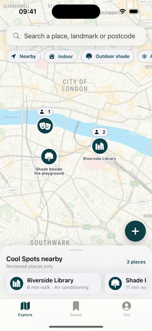
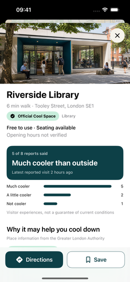
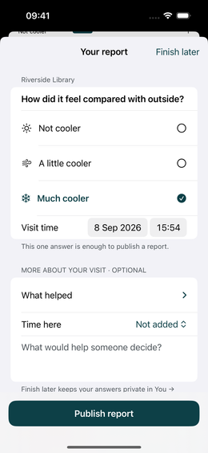

# Cool Spot

**Find a place to cool down.**

## Why Cool Spot?

Londoners need somewhere to cool down on hot days, but scattered information about how places feel, who can use them and what they cost leaves people guessing.

## See the app

  

*Screens show example places and reports.*

- **Find your next cooling spot.** Explore indoor spaces and outdoor shade; filter for AC, water or free use.
- **Decide before you go.** Check facilities, entry conditions and visitor experiences. Save a place or open walking directions in Apple Maps.
- **Help the next visitor.** Share how a visit felt, or propose a missing spot—even a patch of shade beside a playground.
